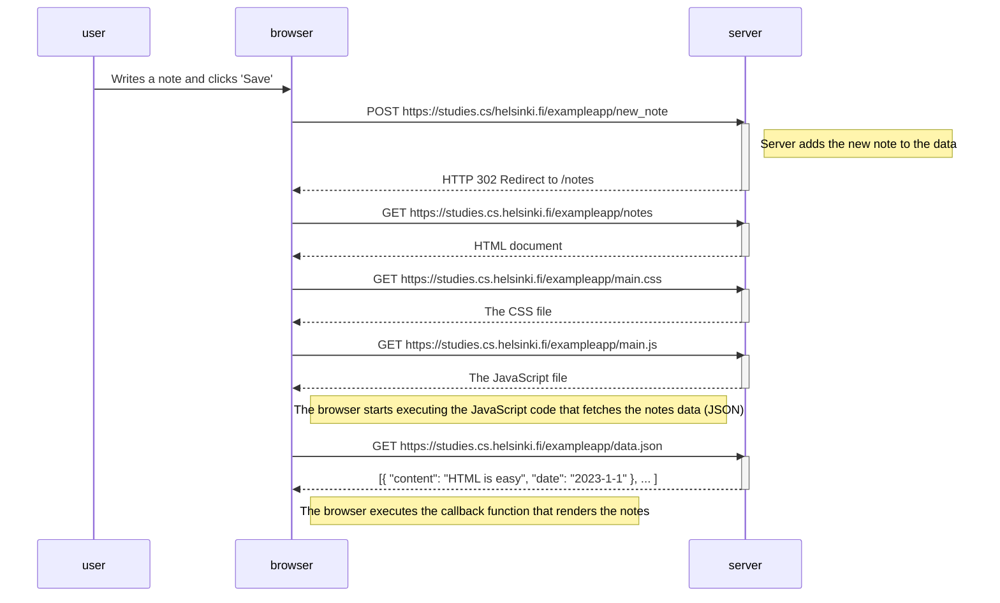
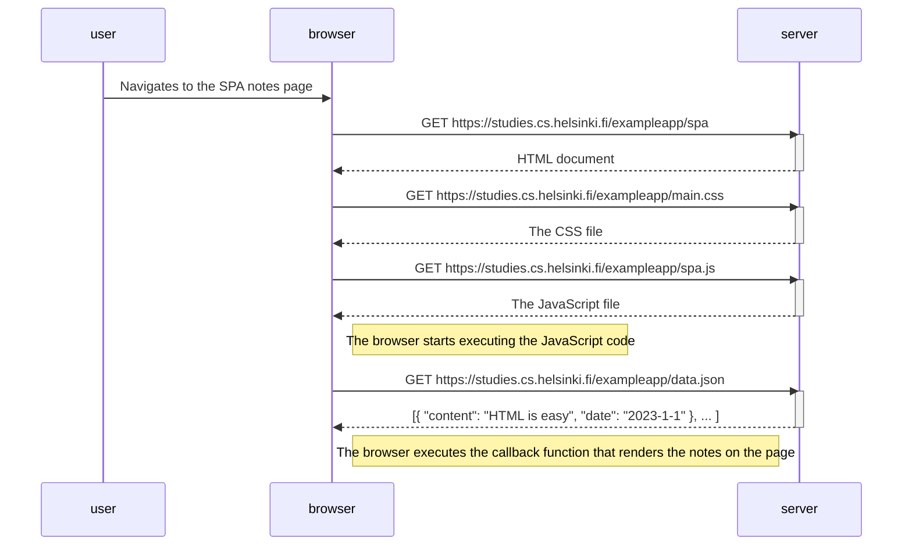

# Part 0 Answers

## Exercise 0.4


## Exercise 0.5


## Exercise 0.6 
``` mermaid
sequenceDiagram
    participant user
    participant browser
    participant server

    user->>browser: Writes a note and clicks 'Save'
    Note right of browser: The browser's JavaScript code handles the form submission

    browser->>server: POST https://studies.cs.helsinki.fi/exampleapp/new_note_spa
    activate server
    Note right of server: The server processes the new note and saves it. The note data is sent in the request's JSON payload.
    server-->>browser: HTTP 201 Created (with the new note data: {"message":"note created"})
    deactivate server

    Note right of browser: The browser's JavaScript receives the response. It does not reload the page but instead redraws the notes list, adding the new note dynamically.
